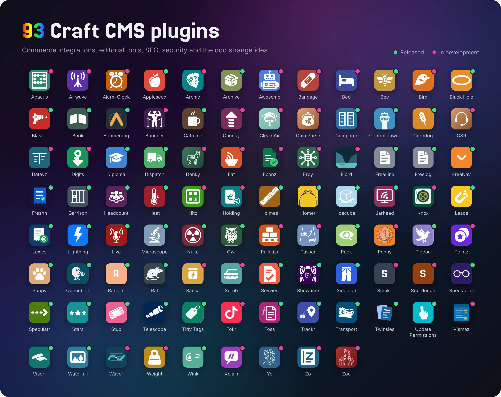

  

I build things on [Craft CMS](https://craftcms.com), and have been building for the web for 27+ years. Agencies bring me in for custom development, Commerce work, plugin builds, DevOps and hosting, or as a second seat developer when their team is stretched. Lately a lot of that work involves AI: agent tooling, GEO, and making Craft sites easy for machines to read.

  
  
  

### Stack

### Plugins

<b>The full list, with links</b>

<!-- plugins:start -->
**Released**

| | Plugin | |
| --- | --- | --- |
|  | [Appleseed](https://craft-appleseed.com) | Broken link checker |
|  | [Archive](https://craft-archive.com) | Whole-site export bundles |
|  | [Bee](https://justinholt.com/plugins/craft-bee/) | Recombee recommendations for Craft |
|  | [Black Hole](https://justinholt.com/plugins/craft-blackhole/) | A honeypot for bad bots |
|  | [Blaster](https://justinholt.com/plugins/craft-blaster/) | Say it at the top of the page |
|  | [Book](https://justinholt.com/plugins/craft-book/) | Any document, on the page |
|  | [Boomerang](https://justinholt.com/plugins/craft-boomerang/) | Returns and store credit for Craft Commerce |
|  | [Caffeine](https://craft-caffeine.com) | Instant faceted search |
|  | [Comparer](https://justinholt.com/plugins/craft-comparer/) | Side-by-side comparison for Craft CMS |
|  | [Control Tower](https://craft-controltower.com) | Operational monitoring dashboard |
|  | [Corndog](https://justinholt.com/plugins/craft-corndog/) | Every email, on a stick |
|  | [Diploma](https://craft-diploma.com) | Courses & certifications |
|  | [Dispatch](https://craft-dispatch.com) | Email marketing & newsletters |
|  | [FreeLink](https://craft-freelink.com) | Powerful link field |
|  | [Freelog](https://craft-freelogs.com) | Server log viewer |
|  | [FreeNav](https://craft-freenav.com) | Navigation menu builder |
|  | [Freshh](https://justinholt.com/plugins/craft-freshh/) | FreshBooks accounting for Craft Commerce |
|  | [Garrison](https://craft-garrison.com) | Security suite |
|  | [Headcount](https://craft-headcount.com) | Membership & subscriptions |
|  | [Heat](https://craft-heat.com) | Load simulation & capacity planning |
|  | [Holmes](https://craft-holmes.com) | Search index audits and repair |
|  | [Homer](https://craft-homer.com) | Content safety & integrity |
|  | [Icecube](https://craft-icecube.com) | Password protection for content |
|  | [Jarhead](https://justinholt.com/plugins/craft-jarhead/) | Hotjar for Craft CMS |
|  | [Leads](https://craft-leads.com) | Popups & lead generation |
|  | [Lexies](https://justinholt.com/plugins/craft-lexies/) | Lexware Office invoicing for Craft Commerce |
|  | [Lightning](https://craft-lightning.com) | PageSpeed Insights |
|  | [Live](https://craft-live.com) | Minute-by-minute live blogging |
|  | [Microscope](https://craft-microscope.com) | Performance audit with fixes |
|  | [Nuke](https://craft-nuke.com) | Guarded bulk deletion & housekeeping |
|  | [Owl](https://craft-owl.com) | Events & calendars |
|  | [Peek](https://craft-peek.com) | Content staging & visual diff |
|  | [Pigeon](https://craft-pigeon.com) | Two-way messaging & support inbox |
|  | [Puppy](https://craft-puppy.com) | CP session trail companion |
|  | [Queuebert](https://craft-queuebert.com) | Live queue activity bar |
|  | [Rabbits](https://craft-rabbits.com) | Visual component builder |
|  | [Rat](https://craft-rat.com) | Author attribution & edit history |
|  | [Sevvies](https://justinholt.com/plugins/craft-sevvies/) | sevDesk invoicing for Craft Commerce |
|  | [Showtime](https://craft-showtime.com) | Events + bookings + memberships |
|  | [Sidepipe](https://justinholt.com/plugins/craft-sidepipe/) | Some fields belong on the right |
|  | [Spectacles](https://craft-spectacles.com) | AI similar-image search |
|  | [Speculatr](https://justinholt.com/plugins/craft-speculatr/) | The next page, loaded before the click |
|  | [Stars](https://craft-stars.com) | Reviews & star ratings |
|  | [Stub](https://craft-stub.com) | Booking & scheduling |
|  | [Telescope](https://craft-telescope.com) | Per-entry GA4 analytics |
|  | [Tidy Tags](https://craft-tidytags.com) | Tag manager & duplicate detection |
|  | [Toss](https://justinholt.com/plugins/craft-toss/) | Terms and privacy policies you did not have to write |
|  | [Trackr](https://justinholt.com/plugins/craft-trackr/) | Shipment tracking for Craft Commerce |
|  | [Transport](https://craft-transport.com) | Content migration & deployment |
|  | [Twinsies](https://justinholt.com/plugins/craft-twinsies/) | Twinfield integration for Craft Commerce |
|  | [Update Permissions Reminder](https://craft-update-permissions-reminder.com) | Permission update reminders |
|  | [Visorr](https://justinholt.com/plugins/craft-visorr/) | See what actually changed |
|  | [Waterfall](https://justinholt.com/plugins/craft-waterfall/) | Your mark, on every image |
|  | [Wink](https://craft-wink.com) | A/B testing & experimentation |

**In development**

| | Plugin | |
| --- | --- | --- |
|  | [Abacus](https://justinholt.com/plugins/craft-abacus/) | Sequential order numbers for Craft Commerce |
|  | [Airwave](https://justinholt.com/plugins/craft-airwave/) | Read the web's feeds. Publish your own. |
|  | [Alarm Clock](https://justinholt.com/plugins/craft-alarmclock/) | Scheduled publishing that tells you it happened |
|  | [Archie](https://justinholt.com/plugins/craft-archie/) | Content model blueprints for Craft 5 |
|  | [Awesemo](https://justinholt.com/plugins/craft-awesemo/) | Font Awesome, managed |
|  | [Bandage](https://justinholt.com/plugins/craft-bandage/) | The missing half of Contact Form |
|  | [Bed](https://justinholt.com/plugins/craft-bed/) | Every embed gets a bed |
|  | [Bird](https://justinholt.com/plugins/craft-bird/) | Moneybird bookkeeping for Craft Commerce |
|  | [Bouncer](https://justinholt.com/plugins/craft-bouncer/) | Access rules for content and the files behind it |
|  | [Chunky](https://justinholt.com/plugins/craft-chunky/) | Uploads too big for your server, in pieces small enough for it |
|  | [Clean Air](https://justinholt.com/plugins/craft-cleanair/) | Ask your content a question |
|  | [Coin Purse](https://justinholt.com/plugins/craft-coinpurse/) | Apple Pay and Google Pay express checkout for Craft Commerce |
|  | [CSR](https://justinholt.com/plugins/craft-csr/) | A knowledge base and support desk for Craft CMS, built to stop tickets before they are raised |
|  | [Datevz](https://justinholt.com/plugins/craft-datevz/) | DATEV bookkeeping export for Craft Commerce |
|  | [Digits](https://justinholt.com/plugins/craft-digits/) | Everything after the sale, for digital downloads |
|  | [Donky](https://justinholt.com/plugins/craft-donky/) | Invoices & packing slips for Craft Commerce |
|  | [Eat](https://justinholt.com/plugins/craft-eat/) | Product feeds for Craft Commerce |
|  | [Econz](https://justinholt.com/plugins/craft-econz/) | e-conomic invoicing for Craft Commerce |
|  | [Erpy](https://justinholt.com/plugins/craft-erpy/) | The ERP gateway for Craft Commerce |
|  | [Fjord](https://justinholt.com/plugins/craft-fjord/) | Sales funnels for Craft Commerce |
|  | [Hitz](https://justinholt.com/plugins/craft-hitz/) | Interactive hall plans for trade fairs and events |
|  | [Holding](https://justinholt.com/plugins/craft-holding/) | Craft Commerce, in your Holded books |
|  | [Knox](https://justinholt.com/plugins/craft-knox/) | Fortnox invoicing for Craft Commerce |
|  | [Palletizr](https://justinholt.com/plugins/craft-palletizr/) | Palletization for Craft Commerce |
|  | [Passer](https://justinholt.com/plugins/craft-passer/) | The complete WordPress to Craft migration |
|  | [Penny](https://justinholt.com/plugins/craft-penny/) | A single-use link to exactly the fields you chose |
|  | [Pointz](https://justinholt.com/plugins/craft-pointz/) | Loyalty points and store credit for Craft Commerce |
|  | [Sanka](https://justinholt.com/plugins/craft-sanka/) | Instant indexing and GEO for Craft CMS |
|  | [Scrub](https://justinholt.com/plugins/craft-scrub/) | Find and replace with a preview, a scope and an undo |
|  | [Smoke](https://craft-smoke.com) | Frontend editing |
|  | [Sourdough](https://craft-sourdough.com) | Schema kits & themes |
|  | [Tokr](https://justinholt.com/plugins/craft-tokr/) | TikTok feeds that render from your database |
|  | [Vismaz](https://justinholt.com/plugins/craft-vismaz/) | Visma eAccounting for Craft Commerce |
|  | [Waver](https://justinholt.com/plugins/craft-waver/) | Wave accounting for Craft Commerce |
|  | [Weight](https://justinholt.com/plugins/craft-weight/) | Weight-based shipping rates for Craft Commerce |
|  | [Xplain](https://justinholt.com/plugins/craft-xplain/) | Your content schema, explained where you build it |
|  | [Yo](https://justinholt.com/plugins/craft-yo/) | A flash-message bus that plugins talk to |
|  | [Zo](https://justinholt.com/plugins/craft-zo/) | Zoho Books for Craft Commerce |
|  | [Zoo](https://justinholt.com/plugins/craft-zoo/) | A census of your content |
<!-- plugins:end -->

### Recent writing

- [Letting Go of "Code Is Art"](https://justinholt.com/blog/letting-go-of-code-is-art/)
- [The Case Against DRY in the Agentic Age](https://justinholt.com/blog/the-case-against-dry-in-the-agentic-age/)
- [The State of AI in Craft CMS 5: Agents, Plugins, and AI-Ready Sites](https://justinholt.com/blog/state-of-ai-craft-cms-5/)

[More on the blog →](https://justinholt.com/blog/)
